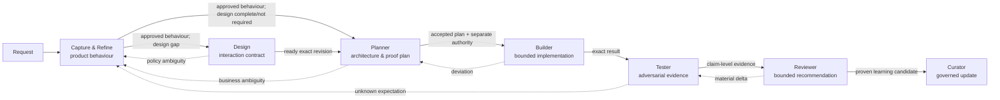

# Seven-agent delivery system

Seven decision owners turn ambiguous product work into inspectable agreements, changes, evidence, and learning. The value is not a seven-step ceremony: each agent has a narrow authority boundary, opens only the skills its case needs, and returns unresolved decisions instead of inventing them.

The canonical revised source is [`agent-system/`](agent-system/). The existing `roles/`, `skills/`, `worked-example/`, `web/`, and `presentation/` directories remain the published masterclass snapshot from `main`; they are deliberately not presented as byte-identical to this revision.

## Why seven agents



- **Capture & Refine** owns agreement on product behaviour, using relevant prior PRDs, behavioural tests, and code—not broad architecture.
- **Design** is conditional. It fills approved-design gaps and distinguishes an authorised editable source from an honest specification-only result.
- **Planner** owns architecture, reuse, contracts, consistency, risk, increments, and proof; business ambiguity goes back.
- **Builder** implements approved bounded increments, follows test feedback, and returns deviations; it cannot self-release.
- **Tester** independently challenges acceptance and never changes an expectation merely to obtain green.
- **Reviewer** judges intent, implementation, and proof; a recommendation is not merge authority.
- **Curator** turns proven learning into approval-gated skill or repository-context updates with versioned history and evaluation.

## Start with one agent

Prerequisite: Python 3.9 or later. From a checkout containing `agent-system/manifest.json`:

```sh
python3 scripts/validate_agent_system.py
python3 scripts/render_agent_prompt.py capture-refine --output capture-refine-agent.md
```

`capture-refine-agent.md` is a portable prompt bundle, not an installer. Read it, replace its project-context placeholder with the relevant repository evidence and host authority, then supply it as system context to your chosen agent host. Start with a request such as:

```text
Create a product-behaviour agreement for “let customers cancel an order.”
Use only the supplied request and relevant prior PRDs, behavioural tests, and code.
Keep every Product decision open until its named owner decides it.
```

The expected output shape is [`agent-system/templates/capture-prd.md`](agent-system/templates/capture-prd.md). No runtime registration or provider-specific installation is claimed.

## Agent and skill map

| Agent | Role | Router skill | Skills opened by the router |
|---|---|---|---|
| Capture & Refine | [role](agent-system/roles/capture-refine.md) | [capture-refine](agent-system/skills/capture-refine/SKILL.md) | [intake and gaps](agent-system/skills/capture-intake-and-gaps/SKILL.md), [engineer interview](agent-system/skills/capture-engineer-interview/SKILL.md), [PRD handoff](agent-system/skills/capture-prd-handoff/SKILL.md) |
| Design | [role](agent-system/roles/design.md) | [design](agent-system/skills/design/SKILL.md) | [input readiness](agent-system/skills/design-input-readiness/SKILL.md), [state and interaction](agent-system/skills/design-state-interaction-spec/SKILL.md), [source readiness](agent-system/skills/design-source-readiness/SKILL.md) |
| Planner | [role](agent-system/roles/planner.md) | [planner](agent-system/skills/planner/SKILL.md) | [impact and invariants](agent-system/skills/planner-impact-and-invariants/SKILL.md), [delivery slices](agent-system/skills/planner-delivery-slices/SKILL.md), [verification and handoff](agent-system/skills/planner-verification-and-handoff/SKILL.md) |
| Builder | [role](agent-system/roles/builder.md) | [builder](agent-system/skills/builder/SKILL.md) | [baseline and RED](agent-system/skills/builder-baseline-and-red/SKILL.md), [bounded change](agent-system/skills/builder-bounded-change/SKILL.md), [verification and deviation](agent-system/skills/builder-verification-and-deviation/SKILL.md) |
| Tester | [role](agent-system/roles/tester.md) | [tester](agent-system/skills/tester/SKILL.md) | [evidence and negative control](agent-system/skills/tester-evidence-and-negative-control/SKILL.md), [adversarial behaviour](agent-system/skills/tester-adversarial-behaviour/SKILL.md), [defect and handoff](agent-system/skills/tester-defect-and-handoff/SKILL.md) |
| Reviewer | [role](agent-system/roles/reviewer.md) | [reviewer](agent-system/skills/reviewer/SKILL.md) | [revision and acceptance](agent-system/skills/reviewer-revision-and-acceptance/SKILL.md), [risk and false green](agent-system/skills/reviewer-risk-and-false-green/SKILL.md), [decision and recheck](agent-system/skills/reviewer-decision-and-recheck/SKILL.md) |
| Curator | [role](agent-system/roles/curator.md) | [curator](agent-system/skills/curator/SKILL.md) | [provenance and classification](agent-system/skills/curator-provenance-and-classification/SKILL.md), [proposal and history](agent-system/skills/curator-proposal-and-history/SKILL.md), [next-use evaluation](agent-system/skills/curator-next-use-evaluation/SKILL.md) |

The machine-readable map is [`agent-system/manifest.json`](agent-system/manifest.json). Shared semantics live once in [`CONCEPTS.md`](agent-system/CONCEPTS.md); permissions and tool boundaries live separately in [`AUTHORITY.md`](agent-system/AUTHORITY.md).

## Follow one request through conditional handoffs

[`agent-system/example/request-to-handoffs.md`](agent-system/example/request-to-handoffs.md) follows one synthetic order-cancellation request. It shows Design being invoked only because approved design is incomplete, ambiguity returning upstream, Builder stopping on a scope deviation, Tester limiting concurrency claims to the observed topology, Reviewer separating merge from release, and Curator keeping skill guidance separate from repository facts.

## Evidence and checks

```sh
python3 scripts/build_refined_agent_system.py
python3 scripts/audit_legacy_skills.py --source /path/to/source-proposal --out docs/audit
python3 scripts/run_scenario_checks.py
python3 scripts/validate_agent_system.py
python3 scripts/build_review_archive.py
python3 -m unittest discover -s tests -v
```

- [`skill-inventory.json`](docs/audit/skill-inventory.json) audits all 7 source routers and 44 source supporting skills file by file.
- [`skill-audit.md`](docs/audit/skill-audit.md) records each contribution, duplication finding, and retain/rewrite/merge decision.
- [`legacy-to-canonical.json`](docs/audit/legacy-to-canonical.json) maps every old path to one maintained canonical path.
- [`scenario-results.json`](docs/audit/scenario-results.json) reports positive and negative deterministic gate simulations for every role.

Structural checks, link checks, archive extraction, and scenario simulations are executable. The scenarios are not live model evaluations. The worked example is illustrative. Independent model behaviour evaluation and content review remain separate evidence needs.

## Portability and authority

The Markdown and Python validation scripts use the standard library. Agent hosts differ in frontmatter parsing, skill discovery, tool names, context limits, and permission systems; adapt the rendered prompt to the host rather than assuming native support. Tools never confer approval. Credentials, external messages, source mutation, merge, deployment, and release require separately supplied host permissions and human authority.

## Contributing

1. Change the one canonical role or skill under `agent-system/`; do not duplicate definitions in presentation or package folders.
2. Give each skill a concrete `Use when …` trigger, required inputs, ordered behaviour, checkable output, and stop condition.
3. Put repository facts in project context, not in a skill. Put permission policy in `AUTHORITY.md`, not in role prose.
4. Add a positive and a refusal/return-path scenario for behavioural changes.
5. Run the checks above and state whether evidence is structural, simulated, or from an actual agent execution.
6. Preserve the published snapshot until a separate site-sync decision is approved.

## Attribution

The refinement applies prompt-authoring ideas studied from Matt Pocock's skills repository at pinned commit `c55ee46073ed923f86ce59a5eb3b6d895095d1b7`; see the [research and license note](docs/research/matt-pocock-skills.md). This repository does not claim Matt Pocock's endorsement. No source prose or templates were copied into the canonical skill set.

The upstream masterclass repository did not declare a project license at the audited revision. The external MIT attribution above does not license this repository; obtain maintainer guidance before redistribution.
