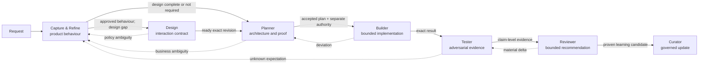

# Seven-agent delivery skills

This repository contains seven focused agents for taking product work from an ambiguous request to an evidence-bound delivery decision. Each agent owns one kind of decision, loads only the skills needed for the case, and returns unresolved questions to the person or agent who owns them.

Start with one agent. Capture & Refine is usually the useful entry point for an unclear feature request; Design is conditional, not a mandatory stage.

## Try it from a fresh clone

The prompt tooling uses only the Python 3 standard library.

```sh
python3 scripts/validate_agent_system.py
python3 scripts/render_agent_prompt.py capture-refine \
  --skill capture-intake-and-gaps \
  --skill capture-engineer-interview \
  --skill capture-prd-handoff \
  --output capture-refine-agent.md
```

`capture-refine-agent.md` contains the role, router, selected skills, output template, and a project-context placeholder. Replace that placeholder with the relevant repository evidence, tools, and authority before giving the file to an agent host. It is a portable prompt, not an installer or a claim of runtime registration.

A narrower intake-only bundle is valid too:

```sh
python3 scripts/render_agent_prompt.py capture-refine \
  --skill capture-intake-and-gaps \
  --output capture-intake-agent.md
```

Use `--all-skills` only when every skill is genuinely relevant. Run `python3 scripts/render_agent_prompt.py --help` for the full interface.

## How the work moves



- **Capture & Refine** agrees observable product behaviour and keeps Product decisions open until their owner decides them.
- **Design** fills approved interaction gaps and distinguishes a specification from an authorised editable-source change.
- **Planner** chooses architecture, contracts, consistency boundaries, delivery slices, migration, and proof without mutating the repository.
- **Builder** implements one authorised increment and returns scope or policy deviations instead of absorbing them.
- **Tester** challenges exact bytes and limits claims to the environment actually exercised.
- **Reviewer** compares intent, implementation, and proof; its recommendation is not merge or release authority.
- **Curator** routes proven learning to one governed destination and separates proposals from adopted history.

See the [worked handoff trace](agent-system/example/request-to-handoffs.md) for a single order-cancellation request moving forward and backward through the system.

## Agent and skill map

The number of supporting skills is intentionally uneven. Conditional work with its own trigger and stop condition—migration safety, concurrency testing, or post-decision history—stays separate rather than being merged to make the table symmetrical.

| Agent | Role | Router | Supporting skills |
|---|---|---|---|
| Capture & Refine | [role](agent-system/roles/capture-refine.md) | [router](agent-system/skills/capture-refine/SKILL.md) | [intake and gaps](agent-system/skills/capture-intake-and-gaps/SKILL.md), [engineer interview](agent-system/skills/capture-engineer-interview/SKILL.md), [PRD handoff](agent-system/skills/capture-prd-handoff/SKILL.md) |
| Design | [role](agent-system/roles/design.md) | [router](agent-system/skills/design/SKILL.md) | [input readiness](agent-system/skills/design-input-readiness/SKILL.md), [state and interaction](agent-system/skills/design-state-interaction-spec/SKILL.md), [source readiness](agent-system/skills/design-source-readiness/SKILL.md) |
| Planner | [role](agent-system/roles/planner.md) | [router](agent-system/skills/planner/SKILL.md) | [impact and invariants](agent-system/skills/planner-impact-and-invariants/SKILL.md), [delivery slices](agent-system/skills/planner-delivery-slices/SKILL.md), [migration and rollout](agent-system/skills/planner-migration-rollout/SKILL.md), [verification and handoff](agent-system/skills/planner-verification-and-handoff/SKILL.md) |
| Builder | [role](agent-system/roles/builder.md) | [router](agent-system/skills/builder/SKILL.md) | [baseline and RED](agent-system/skills/builder-baseline-and-red/SKILL.md), [bounded change](agent-system/skills/builder-bounded-change/SKILL.md), [migration/config safety](agent-system/skills/builder-migration-config-safety/SKILL.md), [verification and deviation](agent-system/skills/builder-verification-and-deviation/SKILL.md) |
| Tester | [role](agent-system/roles/tester.md) | [router](agent-system/skills/tester/SKILL.md) | [evidence and negative control](agent-system/skills/tester-evidence-and-negative-control/SKILL.md), [adversarial behaviour](agent-system/skills/tester-adversarial-behaviour/SKILL.md), [concurrency boundaries](agent-system/skills/tester-concurrency-boundaries/SKILL.md), [defect and handoff](agent-system/skills/tester-defect-and-handoff/SKILL.md) |
| Reviewer | [role](agent-system/roles/reviewer.md) | [router](agent-system/skills/reviewer/SKILL.md) | [revision and acceptance](agent-system/skills/reviewer-revision-and-acceptance/SKILL.md), [risk and false green](agent-system/skills/reviewer-risk-and-false-green/SKILL.md), [decision and recheck](agent-system/skills/reviewer-decision-and-recheck/SKILL.md) |
| Curator | [role](agent-system/roles/curator.md) | [router](agent-system/skills/curator/SKILL.md) | [provenance and classification](agent-system/skills/curator-provenance-and-classification/SKILL.md), [proposal](agent-system/skills/curator-proposal-and-history/SKILL.md), [version history](agent-system/skills/curator-version-history/SKILL.md), [next-use evaluation](agent-system/skills/curator-next-use-evaluation/SKILL.md) |

The machine-readable map is [`agent-system/manifest.json`](agent-system/manifest.json). Shared terms live in [`CONCEPTS.md`](agent-system/CONCEPTS.md); permissions and tool boundaries live in [`AUTHORITY.md`](agent-system/AUTHORITY.md).

## What is canonical

[`agent-system/`](agent-system/) is the maintained source for these agents. Edit its role, router, skill, or template files directly; there is no embedded generator that can overwrite them. The root `roles/`, `skills/`, `worked-example/`, `web/`, and `presentation/` directories are the earlier published masterclass snapshot and remain unchanged pending a separate site-sync decision.

## Verification

These commands work from an ordinary checkout:

```sh
python3 scripts/run_scenario_checks.py
python3 scripts/validate_agent_system.py
python3 scripts/build_review_archive.py
python3 -m unittest discover -s tests -v
```

The legacy audit can be regenerated only by maintainers who also have the unpublished proposal source:

```sh
python3 scripts/audit_legacy_skills.py \
  --source /path/to/source-proposal \
  --out docs/audit
```

Evidence has limits:

- Validation checks structure, links, manifest membership, and audit coverage.
- Scenario checks are deterministic policy simulations, not language-model evaluations.
- The worked example is illustrative.
- The [independent consolidation review](docs/audit/independent-review.md) records manual prompt-level cases and the remaining evaluation gap.
- Cross-provider and repeated-run model evaluation has not been performed.

## Contributing

1. Edit the single canonical file under `agent-system/`; do not duplicate it into the presentation or package snapshot.
2. Give every skill a concrete `Use when …` trigger, inputs, ordered behaviour, output, and stop condition.
3. Split a skill when a branch has a distinct trigger or authority gate. Merge only when using either part alone would create an incomplete action.
4. Keep repository facts in project context and permission policy in `AUTHORITY.md`.
5. Add a positive and a refusal/return-path scenario for behavioural changes.
6. Run the ordinary-checkout commands above and label evidence as structural, simulated, or actual model execution.

## Project notes

Research provenance and third-party attribution are in [`docs/research/matt-pocock-skills.md`](docs/research/matt-pocock-skills.md). The repository did not declare a project license at the reviewed revision; the third-party MIT notice does not license this repository. Maintainer guidance is required before redistribution.
